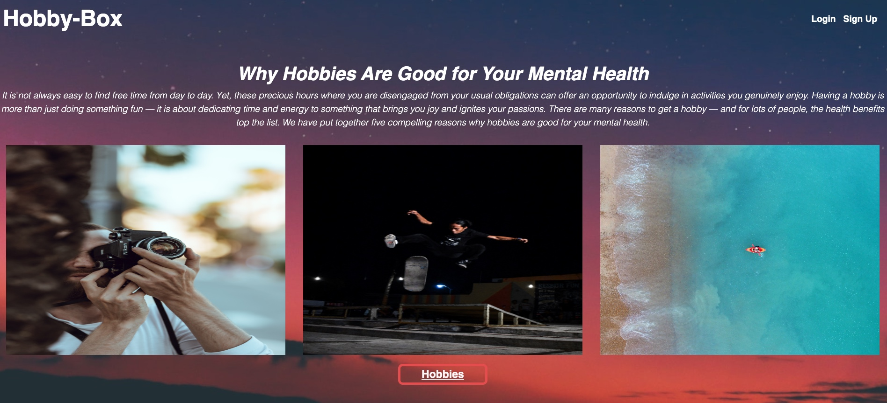
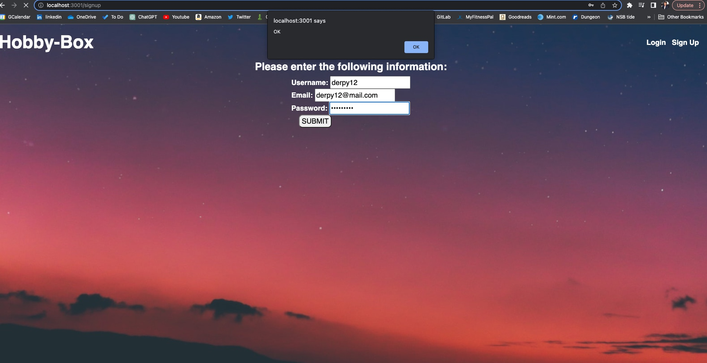
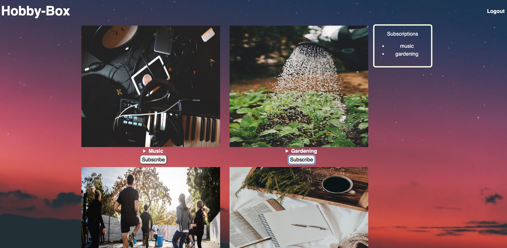

# HobbyBox
HobbyBox is a a Full-Stack Web Developer’s E-Commerce Application. The site is a subscription model where clients can subscribe to a hobby box subscrption of their choice.  The app follows the MVC architecture using Handlebars.js for the front-end templating language. Sequelize as the ORM, and express-session npm package for authentication. The app is hosted on Heroku. The app is built with dotenv, express, express-handlebars, express-session, mySql, and seqeuelize. The following languages used to create this demo are: JavaScript, HTML, CSS.
***

## Acceptance Criteria
Given the user wants to subsribe and try out a hobby for the month
When the user signs up to the Hobby Box monthly subscription with an email, user name and password. And then the account is created
Then the user is presented with a page of hobbies that they can select from for that month
When the user then chooses a a hobby box to try out
Then the users hobby box of choice for the month will be shipped out within 2 - 4 business days to try out for the entire month

## Purpose
Hobby Box was created with the physical and mental wellbeing of others in mind.
It's a monthly subscription based service provided to anyone that wants to try a new hobby, reduce stress or just boost their creativity.
With Hobby Box each month there's a new hobby introduced to the subscriber.
They will have the option to choose whatever hobby they'd like to try out for that month.

## Install
To install all dependencies run:
```
npm install
```
***
## Usage
Run the following command at the root of your project starting with:
```
mysql -u root -p
```
Next, enter your password for MySQL. Once you are in your server run:
```
SOURCE db/schema.sql
quit
```
Then run:
```
npm run seed
```
Finally,
```
npm run start
```
You can download “https://insomnia.rest/download” manipulate/test the data with the GET, POST, PUT, DELETE request.
***
### [Homepage](https://hobbybox.herokuapp.com/ )

### [Github](https://github.com/Qaizen/hobby-box )

## Screenshots for the project 





